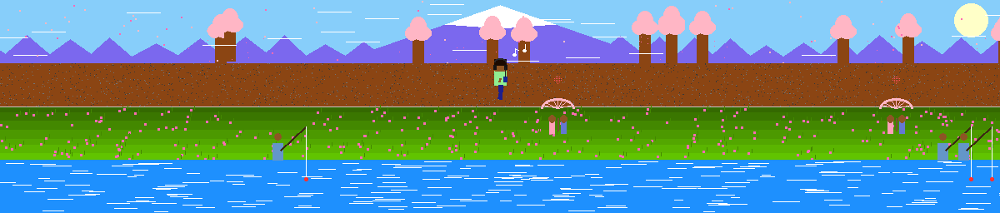

<!-- Full Page Multi-Layer Glass Layout | White & Gold | Minimalist -->

<!-- Main Name Glass -->

ABISIN RAJ
</h1>

  

<!-- Stats Row -->

  
  &nbsp;&nbsp;
  

<!-- WakaTime -->

  

<!-- Currently Building -->

currently building

<!-- Flow Card -->

  <table style="width:100%; border-collapse:collapse;">
    <tr>
      <td style="vertical-align:top; width:55%; padding-right:24px;">
        
Flow

        
A lightweight Linux endpoint security tool that monitors network, process, and file activity to detect suspicious behavior — with minimal privileges and a transparent design.

        
stack

        

          
          
          
        

        
current focus

        
Upgrading from EDR to SIEM level — researching multi-device monitoring architecture.

      </td>
      <td style="vertical-align:top; width:45%;">
        

          
screenshots

           
          <!-- Replace the src URLs below with your actual screenshot links from the Abisin-Raj/assets repo -->
          
          
        

      </td>
    </tr>
  </table>

<!-- Momentum Card -->

  <table style="width:100%; border-collapse:collapse;">
    <tr>
      <td style="vertical-align:top; width:55%; padding-right:24px;">
        
Momentum

        
A cycle-based, offline-first fitness tracker that blooms with your progress.

        
stack

        

          
          
          
          
          
        

        
current focus

        
Actively building — cycle system and 3D progress visualization.

      </td>
      <td style="vertical-align:top; width:45%;">
        

          
screenshots

           
          <!-- Replace the src URLs below with your actual screenshot links from the Abisin-Raj/assets repo -->
          
          
        

      </td>
    </tr>
  </table>

<!-- Tetris GIF Glass -->

  <picture>
    <source media="(prefers-color-scheme: dark)" srcset="https://raw.githubusercontent.com/Abisin-Raj/Abisin-Raj/output-tetris/github-contribution-grid-tetris-dark.gif?v=3">
    
  </picture>

